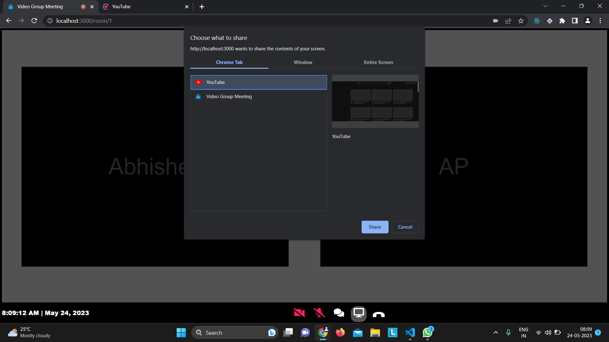

# MeetBuddy

MeetBuddy is a video conferencing and collaboration platform designed for seamless communication and real-time collaboration. It offers features like chat, screen sharing, and notifications when users join the meeting. The platform is user-friendly and efficient for remote meetings.

## Features

- **Video Conferencing**: Connect with multiple participants in real-time.
- **Chat Functionality**: Send messages to other participants during meetings.
- **Screen Sharing**: Share your screen to collaborate effectively.
  
## Screenshots
### Login Page


### Chat Functionality


### Participant Joined Notification


### Screen Sharing in Action


### Another View of Screen Sharing


## Technologies Used

- **Frontend**: React.js for building a responsive and dynamic user interface.
- **Backend**: Node.js with WebSocket for real-time communication.
- **WebRTC**: Used for video and audio streaming.
- **Database**: MongoDB for user and meeting data.


## How to Run Locally

1. Clone the repository:
   ```bash
   git clone https://github.com/Abhip32/MeetBuddy.git
   ```
2. Navigate to the project directory:
   ```bash
   cd MeetBuddy
   ```
3. Install backend dependencies:
   ```bash
   cd backend
   npm install
   ```
4. Start the backend server:
   ```bash
   npm start
   ```
5. Navigate to the `frontend` directory and install dependencies:
   ```bash
   cd ../frontend
   npm install
   ```
6. Start the React development server:
   ```bash
   npm start
   ```
7. Open your browser and visit:
   ```
   http://localhost:3000
   ```

---

### Thank you for using MeetBuddy! 🎥  
Feel free to explore, test, and enhance the project for your needs.
